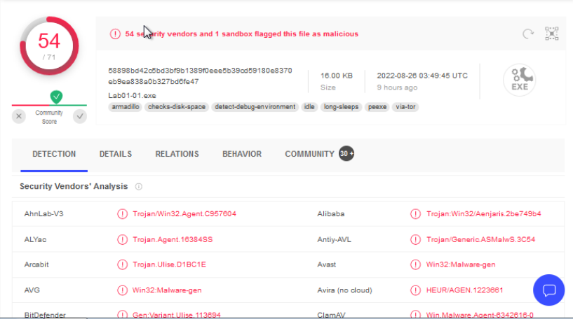

Lab 1 Writeup

Lab 1-1

1. Upload the files to http://www.VirusTotal.com/ and view the reports. Does either file match any existing antivirus signatures?

Yes for Lab1-01.dll it has 43/70 indicators and Lab01-01.exe has 51/71

2.When were these files compiled?

Both were compiled December 19th 2010

3.Are there any indications that either of these files is packed or obfuscated? If so, what are these indicators?

Neither seemed to be packed or obfuscated.

4. Do any imports hint at what this malware does? If so, which imports
are they?

The malware seems to steal some files and exports them through the dll. 

5. Are there any other files or host-based indicators that you could look for on infected systems?

I could look in the C:/* directory in strings, as well as the kerne132.exe which is trying to blend in with kernel32.exe

6. What network-based indicators could be used to find this malware on
infected machines?

There is an IP address in the strings as well as sockets being opened which tells me it is calling back to something.

7. What would you guess is the purpose of these 

This malware is a command and control due to having sockets being opened and reaching out to an IP. Exe is used to run dll due to using create processes and sleep which is used for backdoors

Lab 1-2

1.Upload the Lab01–02.exe file to http://www.VirusTotal.com/. Does it match any existing antivirus definitions?

Yes Lab-01-02.exe matches 56/71 existing antivirus

2. Are there any indications that this file is packed or obfuscated? If so,
what are these indicators? If the file is packed, unpack it if possible?

Yes due to some values being renamed UPX which indicates Ultimate Packer.

3. Do any imports hint at this program’s functionality? If so, which imports are they and what do they tell you?

It seems to use some internet imports so it has something to do with a browser.

4. What host- or network-based indicators could be used to identify this malware on infected machines?

There is a url listed in the strings of the file called http://malwareanalysisbook.com. This can be found by unpacking the file using UPX unpacker.

Lab 1-3

1.Upload the Lab01-03.exe file to http://www.VirusTotal.com/. Does it match any existing antivirus definitions?

When put into VirusTotal the Lab01-03.exe detcted in 56/71 vendors

2. Are there any indications that this file is packed or obfuscated? If so, what are these indicators? If the file is packed, unpack it if possible.
 Yes this malware has indicators it has been packed due to the lack of Strings
3. Do any imports hint at this program’s functionality? If so, which imports are they and what do they tell you?

No there are 2 imports that are vague

4. What host- or network-based indicators could be used to identify this malware on infected machines?

Nothing

Lab 1-4

1.  Upload the Lab01–04.exe file to http://www.VirusTotal.com/. Does it match?

Yes this piece of malware matches 61/71 of antivirus defintions

2. Are there any indications that this file is packed or obfuscated? If so, what are these indicators? If the file is packed, unpack it if possible.

This file doesnt seem to be packed or obfuscated due to the mass amount of functions
3. Do any imports hint at this program’s functionality? If so, which imports are they and what do they tell you?

Aug 30th 22:29:59 2019
4. What host- or network-based indicators could be used to identify this malware on infected machines?

The Network based indicators to use permissions from advapi32.dll as well as uses the internet to update itself. The host based are \winup.exe and \system32\wupdmgrd.exe

5. This file has one resource in the resource section. Use Resource Hacker to examine that resource, and then use it to extract the resource. What can you learn from the resource?

The file uses  http://practicalmalwareanalysis.com/updater.exe to download a its payload and then uses wupdmgr.exe to unpack it and modify files.

6. This file has one resource in the resource section. Use Resource Hacker to examine that resource, and then use it to extract the resource. What can you learn from the resource? 

This writes to an already existing file as a downloader due to the fact that it uses the updater link and then uses \system32\wupdmgrd.exe