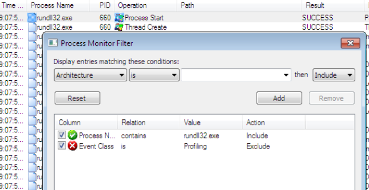

# Lab 3 Writeup

# Lab 3-1

1. What are this malware's imports and strings?

2. What are the malware's host-based indicators? 

The malware's host based indicators are registry keys this can be found using Process Explorer.

3. Are there any useful network-based signatures for this malware? If so, what are they?

 There is a link and an HTTP connect located in the strings.

# Lab 3-2

1. How can you get this malware to install itself?

You can use rundll32.exe with a Install parameter to install it as a service. Traditionally we could use regshot to figure out more info but this program is a bit older and only works with Windows XP.

2. How would you get this malware to run after installation?

I would run the service with the service I installed it under using net start (insert name here) 

3. How can you find the process under which this malware is running?

You can use Procmon to filter on the service name to see what it is doing while running.