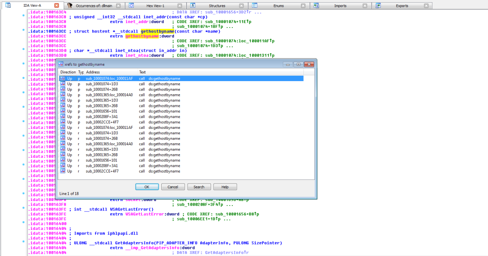
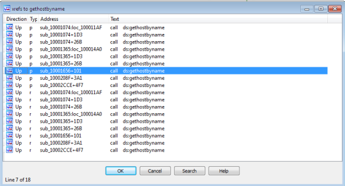
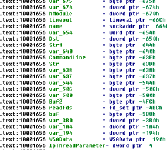
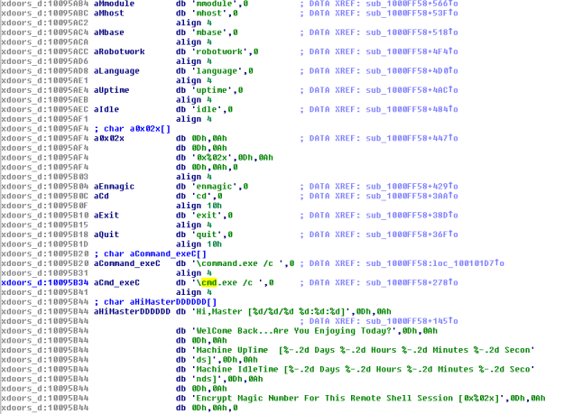
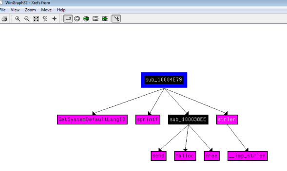
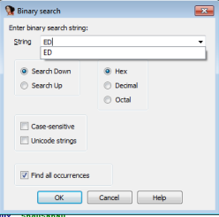
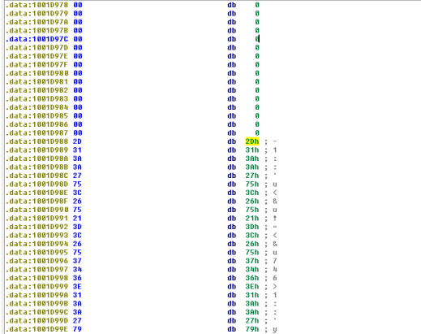
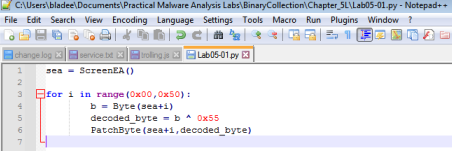

# Lab 5 Writeup

# Lab 5-1

1. What is the address of DllMain?

To find the address of DLLMain we will do a search for the text DLLmain. Then we will go to the address and copy it

2. Use the Imports window to browse to gethostbyname. Where is the import located?

By going to the imports tab we can navigate to gethostbyname to find its address.

3. How many functions call gethostbyname?

To find the amount of times the function gethostbyname is called we have to go to the function and press CTRL-X and we will get a list of cross references.

4. Focusing on the call to gethostbyname located at 0x10001757, can you figure out which DNS request will be made?

By navigating to the register (sub_0x10001656+101) on the Cross reference list we can click this to go to 0x10001757 and it can be seen that this call of the function has one parameter that is pushed by the eax register. Clicking the parameter that is pushed reveals the domain that is being called. 

5. How many local variables has IDA Pro recognized for the subroutine at 0x10001656?

Pressing G and jumping to 10001656 we can see that there are 24 variables listed.

6. How many parameters has IDA Pro recognized for the subroutine at 0x10001656?

As seen there is one parameter that could be located in this subroutine

7. Use the Strings window to locate the string \cmd.exe /c in the disassembly. Where is it located?

Opening up the Strings tab under the View Tab we can find the location.

8. What is happening in the area of code that references \cmd.exe /c?

The code in this section seems to be setting up a remote shell as we can tell due to the string mentioning encrypting a magic code for a remote shell.

9. In the same area, at 0x100101C8, it looks like dword_1008E5C4 is a global variable that helps decide which path to take. How does the malware set dword_1008E5C4? (Hint: Use dword 1008E5C4’s cross-references.)

By pressing X on dword_1008E5C4 we can see that this variable is set once with the mov command. Investigating what was actually pushed to the value by checking the call located above the function we can determine this fuction is probably checking to make sure that this Windows version is above 2000.

10. A few hundred lines into the subroutine at 0x1000FF58, a series of comparisons use memcmp to compare strings. What happens if the string comparison to robotwork is successful (when memcmp returns 0)?

If the comparison is sucessful we can see that this checks if a value is not 0 through the jnz (checks if value isnt 0) comparsion. Jumping to that operation shows the location of a registry key which means this function is most likely checking to see if a certain registry exists.

11. What does the export PSLIST do?

Judging by the identity of of the subroutines in the export PSLIST we can see that this is doing a check and judging by their references we can it querying for more OS information as well as using the call for createtoolhelp32snapshot which helps enumerate processes and process ID.

12. Use the graph mode to graph the cross-references from sub_10004E79. Which API functions could be called by entering this function? Based on the API functions alone, what could you
rename this function?

When we graph the function we can see that this gets an API call for Language ID and then sends it over a network. You could rename this function grabLanguageID.

13. How many Windows API functions does DllMain call directly? How many at a depth of 2?

We can see how many Windows API function DLLMain calls directly by scrolling to the address of the subroutine of DLLMain. We can scroll and take note or click the name of the subroutine and graph it by going to View then Graph, then pick User Xref Chart. Make sure to uncheck Cross references to and change recusion deph to 1. This will show all the Windows API functions.

14. At 0x10001358, there is a call to Sleep (an API function that takes one parameter containingthe number of milliseconds to sleep). Looking backward through the code, how long will the
program sleep if this code executes?

To figure this out the best way to find this out is to work backwards. First we can see the variable dwMiliseconds so it can be inferred this in in miliseconds. Next we can see a multipication command with a hex value. When we convert 3E8 to decimal we get 1000 so whatever value is in the EAX register is multiplied by 1000. Going further back we can see the value off_10019020 is equal to 30. So it can be seen that this is the value pushed into EAX. The full equeation would be 30 * 1000 which = 30,000. The total miliseconds of sleep is 30,000 (30 seconds).

15. At 0x10001701 is a call to socket. What are the three parameters?

The three parameter are listed as Protocol which is 6 in iPV4 the 6th protocol often refers to TCP. The next paramter name is AF which is most likely referring to AF_INET which is an address family for IPV4. 

16. Using the MSDN page for socket and the named symbolic constants functionality in IDA Pro, can you make the parameters more meaningful? What are the parameters after you apply changes?

These are the symbolic constants I applied.

17.  Search for usage of the in instruction (opcode 0xED). This instruction is used with a magic string VMXh to perform VMware detection. Is that in use in this malware? Using the cross-references to the function that executes the in instruction, is there further evidence of VMware detection?

When conducting a search on the opcode we are brought to the only instance of "in". Within this section we can find the variable "0x564D5868" with is the ASCII string "VMXh" which suggests that this malware does a Virtual Machine check. Checking the cross references of this function find that at another location the string "Virtual Machine Found, Install Cancel." which further supports this theroy. 

18. Jump your cursor to 0x1001D988. What do you find?

We find a bunch of unreadable data with the charachter '-'.

19. If you have the IDA Python plug-in installed (included with the commercial version of IDA Pro), run Lab05-01.py, an IDA Pro Python script provided with the malware for this book. (Make sure the cursor is at 0x1001D988.) What happens after you run the script?

After the script is run this changes the strings to human readable text which spells out " xdoor is this backdoor, string decoded for Practical Malware Analysis Lab :)1234."

20. With the cursor in the same location, how do you turn this data into a single ASCII string?

We can do this by pressing A which will format everything.

21. Open the script with a text editor. How does it work?

This script uses an XOR of 0x55 prints out the resulting byte. 

